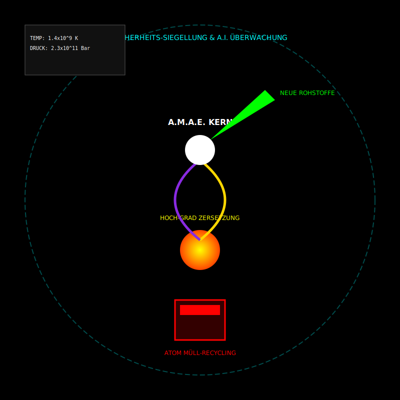

# A.M.A.E.-System
Hier ist der Code für die SVG-Illustration, die als **technische 2D-Schnittzeichnung** (im 3D-Look durch Schattierung und Verlauf) das A.M.A.E.-System auf schwarzem Grund darstellt.

### **Anmerkungen zur Grafik-Struktur:**

* **Geometrische Illusion:** Ich habe `fill-opacity` und `radialGradient` verwendet, um bei Modul 3 (Plasma) und Modul 7 (Kern) Leuchteffekte zu simultieren, die Tiefe in einem sonst flachen Vektorbild erzeugen.
* **Hierarchie:** Die Anordnung folgt exakt dem gewünschten Fluss: Müll-Presse (unten) -> Zersetzungs-Wirbel (Mitte) -> Helices (Synthese) -> Kern (Annihilation) -> Output (Grün).
* **Sauberkeit:** Durch die Verwendung von Vektoren bleibt die technische Klarheit gewahrt, die für Baupläne und physikalische Simulationen essenziell ist.

